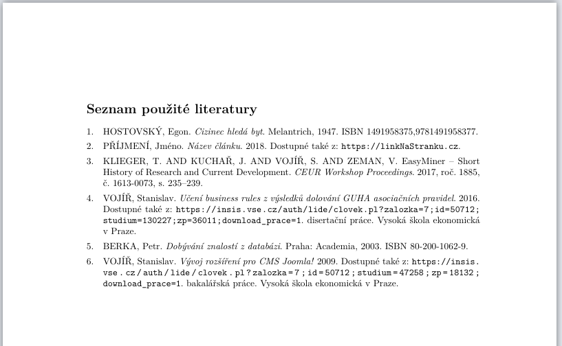

# Jak udělat bibliografii v LaTEXu

1. vytvoř si v projektu nový soubor ```literatura.bib```
2. na vršek souboru ```main.tex``` přidej tento kód:
```TeX
%%% Nastavení pro použití samostatné bibliografické databáze.
\usepackage[
   backend=biber
  ,style=iso-numeric
  ,bibencoding=UTF8
]{biblatex}
\let\cite\parencite
\bibliography{literatura}
```
3. do souboru ```literatura.bib``` si přidej tuhle citaci na zkoušku. Jak ty citace správně napsat, je dole.
```
@Book{
   timtoSeOdkazuju,
   title =     {Cizinec hledá byt},
   author =    {Egon Hostovský},
   publisher = {Melantrich},
   isbn =      {9781491958377},
   year =      {1947}
}   
```
5. někde na konci dokumentu urči, kde se seznam literatury vytiskne:
```TeX
\printbibliography[title={Seznam použité literatury},heading={bibintoc}]
```
6. na libovolném místě v textu použij citaci:
```TeX
nějaký text\cite{timtoSeOdkazuju} %mezi \cite a textem by němel být bílý znak (mezera)
```
7. <kbd>Ctrl+S</kbd> pro zkompilování kódu. Měl by se potom objevit seznam použité literatury s jednou citací. Takže pak už jenom přidáváš citace do ```literatura.bib``` a ```\cite``` příkazy do text. Nakonec ti to samo vygeneruje takovýto pěkný seznam:



# Příklady citací
To, jak napíšeš tu citaci do té ```literatura.bib```, záleží na tom, co za typ zdroje to je. Tady je [odkaz](https://www.overleaf.com/learn/latex/Bibliography_management_with_bibtex#Reference_guide) na všechny ostatní typy.

## článek na internetu
```
@misc{
clanek1, 
title={Název článku}, 
url={https://linkNaStranku.cz}, 
journal={Název webu, kde je článek},
author={Příjmení, Jméno},
year={2018}, 
month={Březen}
} 
```
## vědecký článek
```
@article{
Vojir2017,
author =       "{Klieger, T. and Kuchař, J. and Vojíř, S. and Zeman, V.}",
title =        "{EasyMiner – Short History of Research and Current Development}",
journal =      "{CEUR Workshop Proceedings}",
volume =       "{1885}",
number =       "{1613-0073}",
pages =        "{235--239}",
year =         "{2017}"
}
```
## normální knížka nějaká
```
@Book{
berka2003,
author = {Berka, Petr},
title = {Dobývání znalostí z databázi},   
publisher = {Academia},
year = {2003},
address = {Praha},
isbn = {80-200-1062-9}
}
```
## disertační práce
```
@phdthesis{
Vojir2016,
Type = {disertační práce},
Title = {Učení business rules z výsledků dolování GUHA asociačních pravidel},
Author = {Vojíř, Stanislav},
School = {Vysoká škola ekonomická v Praze},
URL = {https://insis.vse.cz/auth/lide/clovek.pl?zalozka=7;id=50712;studium=130227;zp=36011;download_prace=1},
Year = {2016}
}
```
## obecně vědecká kvalifikační práce nějaká
```
@thesis{
Vojir2009,
Type = {bakalářská práce},
Title = {Vývoj rozšíření pro CMS Joomla!},
Author = {Vojíř, Stanislav},
School = {Vysoká škola ekonomická v Praze},
URL = {https://insis.vse.cz/auth/lide/clovek.pl?zalozka=7;id=50712;studium=47258;zp=18132;download_prace=1},
Year = {2009}
}
```